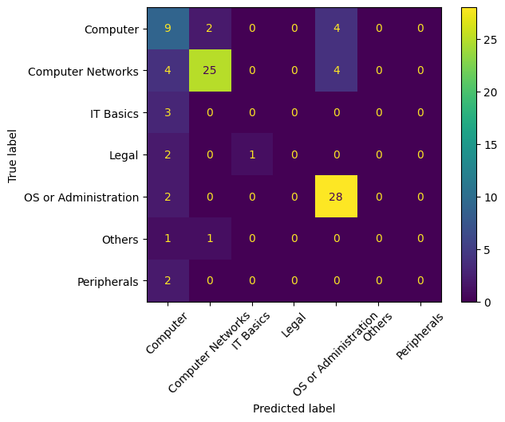
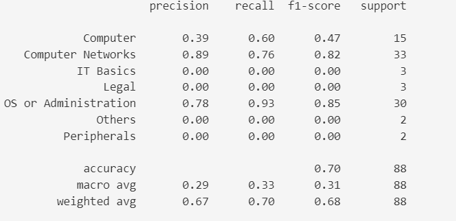

# Target of the project:
To explore NLP with the help of NLTK, sklearn and Tensorflow.
It classifies question from Polish IT technician exam into one of the 7 categories.

### TL;DR - What I learnt:
* I spent most time (80%) on trying to figure out how to properly clean and preprocess data. It's more about building a "pipeline" rather than actual training of the model.
* For the first time I used NLTK and label-studio and NLP features of TF.
* Dataset was heavily imbalanced and I saw how it affects the model. Majority of quetions were about either Computer Networks or Operating Systems or Administration. This is to be improved in the future.

## Description of the project
### Dataset (Input)
It's 440 questions from Polish IT technician exam. Each question is classified into one of the 7 categories:
- 1 - Computers (question about computers, hardware, software, etc.)
- 2 - Computer Networks
- 3 - Informatics Basics (mathematics, logic, physics etc.)
- 4 - Legal (law, regulations, etc.)
- 5 - Operating Systems or Administration
- 6 - Peripherals (printers, monitors, etc.)
- 7 - Others (questions that don't fit into any of the above categories)
Labelling was done with label-studio by me.
### Output
It's a model that classifies questions into one of the 7 categories.
## Methodology
1. Data cleaning
2. Data preprocessing
3. Model training
4. Model evaluation
### Data cleaning and preprocessing
First of all it consisted of replacing all technical things like Ipv4 or filenames or computer commands with "tags". Also removing of stopwords and punctuation. 
Lemmatization was done with NLTK's wordnet lemmatizer. Labels were one-hot encoded.
### Model training
I used TF's Keras API. Two dropout layers with one LSTM layer in between. I used Adam optimizer and sparse categorical crossentropy as loss function.
### Model evaluation
I used sklearn's classification report and confusion matrix. 
## Results

As seen, the dataset is heavily imbalanced. The model is very good at classifying questions about Computer Networks and Operating Systems or Administration which are the most common categories. It also can a little bit classify questions about Computers, but then it cannot classify anything else. This is due to the fact that the dataset is imbalanced.
It's surprising than even though question about IT basics contain really unique words like "unit" model still cannot classify it.